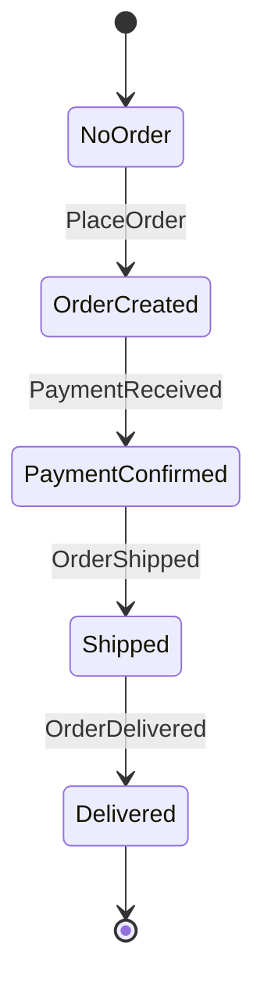

# Fluent Workflow Builder

**Last Updated:** 2025-01-22
**Status:** In Progress - Core Implementation Complete

---

## Overview

A fluent API for defining workflows that enables:
1. **Cleaner syntax** - Declarative, readable workflow definitions
2. **Built-in introspection** - Diagram generation comes for free
3. **Type-safe** - Compiler catches errors at build time

This is an alternative to the switch-expression based `Workflow<TInput, TState, TOutput>` base class.

---

## Motivation

The original workflow pattern uses switch expressions:

```csharp
// Hard to parse with static analysis
protected override State InternalEvolve(State state, WorkflowEvent evt)
{
    return (state, evt) switch
    {
        (NoOrder n, InitiatedBy { Message: PlaceOrder m }) => new OrderCreated(m.OrderId),
        (OrderCreated s, Received { Message: PaymentReceived m }) => new PaymentConfirmed(m.OrderId),
        // ... complex pattern matching
        _ => state
    };
}
```

**Problems:**
- Static analysis (Roslyn) struggles to extract transitions from complex patterns
- Helper methods break extraction completely
- Conditional logic (ternary expressions) not captured

**Solution:** Fluent builder that captures transitions as data.

---

## Architecture

### Files Created

| File | Purpose |
|------|---------|
| `Fluent/WorkflowDefinition.cs` | Data model capturing states and transitions |
| `Fluent/FluentBuilders.cs` | StateBuilder, TransitionBuilder, etc. |
| `Fluent/FluentWorkflow.cs` | Base class with Initially/During methods |

### Class Hierarchy

```
FluentWorkflow<TInput, TState, TOutput>
    ├── Definition: WorkflowDefinition<TInput, TState, TOutput>
    │       ├── States: List<StateDefinition>
    │       │       ├── StateType: Type
    │       │       ├── IsInitial: bool
    │       │       └── Transitions: List<TransitionDefinition>
    │       │               ├── MessageType: Type
    │       │               ├── TargetStateType: Type
    │       │               ├── Stay: bool
    │       │               ├── CommandsFactory: Func<...>
    │       │               ├── Condition: Func<...>
    │       │               └── ElseBranch: TransitionDefinition
    │       └── InitialStateType: Type
    │
    ├── Initially<TState>() → StateBuilder
    ├── During<TState>() → StateBuilder
    ├── Process(input, state) → (Commands, NewState)
    ├── ToMermaidStateDiagram() → string
    └── ToMermaidFlowchart() → string
```

---

## Usage

### Basic Workflow Definition

```csharp
public class OrderWorkflow : FluentWorkflow<OrderInput, OrderState, OrderOutput>
{
    public OrderWorkflow()
    {
        Initially<NoOrder>()
            .On<PlaceOrder>()
            .Execute(ctx => [
                Send(new ProcessPayment(ctx.Message.OrderId)),
                Send(new NotifyOrderPlaced(ctx.Message.OrderId))
            ])
            .TransitionTo<OrderCreated>();

        During<OrderCreated>()
            .On<PaymentReceived>()
            .Execute(ctx => [Send(new ShipOrder(ctx.Message.OrderId))])
            .TransitionTo<PaymentConfirmed>();

        During<PaymentConfirmed>()
            .On<OrderShipped>()
            .Execute(ctx => [Send(new NotifyShipped(ctx.Message.TrackingNumber))])
            .TransitionTo<Shipped>();

        During<Shipped>()
            .On<OrderDelivered>()
            .Execute(ctx => [
                Send(new NotifyDelivered(ctx.Message.OrderId)),
                Complete()
            ])
            .TransitionTo<Delivered>();
    }
}
```

### Conditional Transitions

```csharp
During<Pending>()
    .On<GuestCheckedOut>()
    .If(ctx => AllGuestsProcessed(ctx.State, ctx.Message.GuestId),
        description: "all guests processed")
        .Execute(ctx => [
            Send(new GroupCheckoutCompleted(ctx.State.GroupCheckoutId)),
            Complete()
        ])
        .TransitionTo<Finished>()
    .Else()
        .DoNothing()
        .Stay();
```

### No Commands (Just Transition)

```csharp
During<Processing>()
    .On<StatusUpdate>()
    .DoNothing()
    .Stay();  // Remain in same state
```

### Generating Diagrams

```csharp
var workflow = new OrderWorkflow();

// State diagram (stateDiagram-v2)
Console.WriteLine(workflow.ToMermaidStateDiagram());

// Flowchart
Console.WriteLine(workflow.ToMermaidFlowchart());
```

### Processing Messages

```csharp
var workflow = new OrderWorkflow();
var currentState = new NoOrder();

var (commands, newState) = workflow.Process(new PlaceOrder("order-123"), currentState);

// commands = [Send(ProcessPayment), Send(NotifyOrderPlaced)]
// newState = OrderCreated { OrderId = "order-123" }
```

---

## Fluent API Reference

### StateBuilder

```csharp
Initially<TState>()           // Define initial state behavior
During<TState>()              // Define behavior during a state
    .On<TMessage>()           // When this message arrives...
```

### TransitionBuilder (after On<>)

```csharp
.On<TMessage>()
    .Execute(ctx => [...])    // Commands to execute
    .DoNothing()              // No commands
    .TransitionTo<TState>()   // Move to new state
    .Stay()                   // Remain in current state
```

### ConditionalTransitionBuilder (after If)

```csharp
.On<TMessage>()
    .If(ctx => condition, "description")
        .Execute(ctx => [...])
        .TransitionTo<TState>()
    .Else()
        .DoNothing()
        .Stay()
```

### TransitionContext

```csharp
ctx.State    // Current state (typed)
ctx.Message  // Incoming message (typed)
```

### Command Helpers

```csharp
Send(message)              // Send command to handler
Publish(message)           // Publish event
Schedule(delay, message)   // Schedule delayed message
Reply(message)             // Reply to query
Complete()                 // Complete workflow
```

---

## Comparison: Switch vs Fluent

| Aspect | Switch Pattern | Fluent Builder |
|--------|---------------|----------------|
| **Diagram generation** | Hard (Roslyn analysis) | Trivial (data captured) |
| **Readability** | Dense, nested | Linear, declarative |
| **Conditional logic** | Ternary in expression | `.If()/.Else()` chain |
| **Helper methods** | Breaks analysis | Fully supported |
| **Validation** | Runtime only | Can validate at config |
| **Type safety** | Good | Good |
| **Familiarity** | C# developers | MassTransit/Stateless users |

---

## TODO

- [ ] Create `GroupCheckoutFluentWorkflow` example
- [ ] Add tests for fluent workflow
- [ ] Handle state creation with constructor parameters
- [ ] Add validation (unreachable states, missing transitions)
- [ ] Consider async version (`FluentAsyncWorkflow`)
- [ ] Integration with existing `WorkflowOrchestrator`

---

## Generated Diagram Example

For a workflow defined with the fluent API:



---

## Design Decisions

### Why Constructor-based Configuration?

Similar to MassTransit sagas - configuration happens in constructor:
- Clean syntax (no `Configure(builder)` parameter needed)
- Base class methods (`Initially`, `During`) add to internal definition
- Definition is fully captured before first use

### Why Separate If/Else Builders?

To ensure proper chaining:
```csharp
.If(condition)
    .Execute(...)
    .TransitionTo<StateA>()
.Else()                      // Must come after TransitionTo
    .Execute(...)
    .Stay()
```

The builder types enforce this order at compile time.

### State Creation

Current implementation uses `Activator.CreateInstance` (parameterless constructor).
For states with parameters, override `CreateNewState`:

```csharp
protected override TState CreateNewState(Type targetStateType, TState currentState, TInput input)
{
    // Custom state creation logic
    if (targetStateType == typeof(OrderCreated) && input is PlaceOrder po)
        return (TState)(object)new OrderCreated(po.OrderId);

    return base.CreateNewState(targetStateType, currentState, input);
}
```

---

## References

- MassTransit State Machine: https://masstransit.io/documentation/patterns/saga/state-machine
- Stateless Library: https://github.com/dotnet-state-machine/stateless
- Original Workflow Pattern: See `ARCHITECTURE.md`

---

**Last Updated:** 2025-01-22
