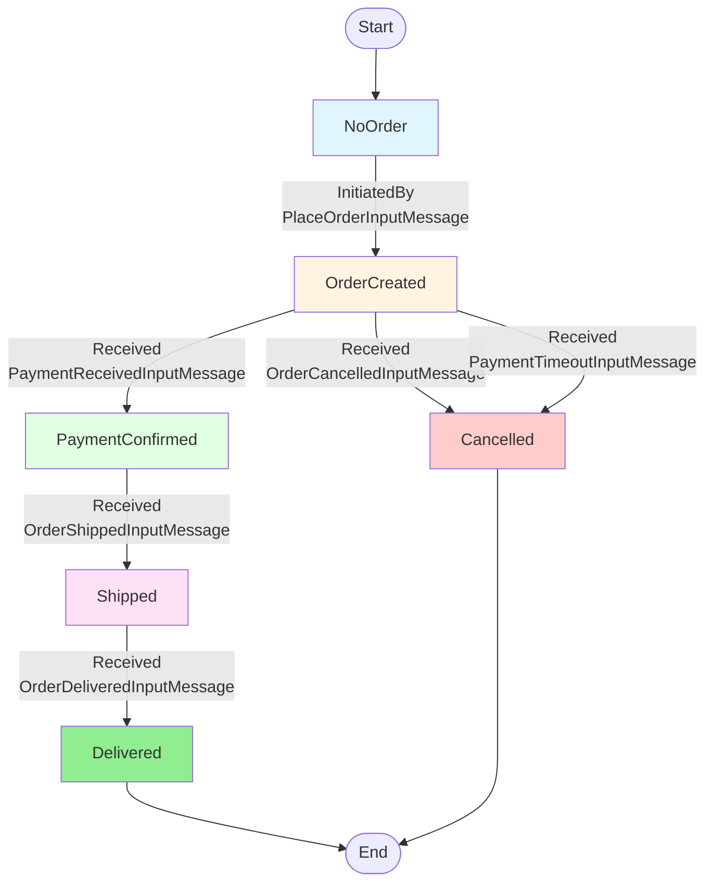

# OrderProcessingWorkflow - State Transitions (InternalEvolve)

This diagram shows the state transitions based on the `InternalEvolve` method of the synchronous OrderProcessingWorkflow.

## State Descriptions

- **NoOrder**: Initial state, no order exists yet
- **OrderCreated**: Order has been placed, awaiting payment
- **PaymentConfirmed**: Payment received successfully
- **Shipped**: Order has been shipped with tracking number
- **Delivered**: Order successfully delivered (terminal state)
- **Cancelled**: Order cancelled due to timeout or customer request (terminal state)
