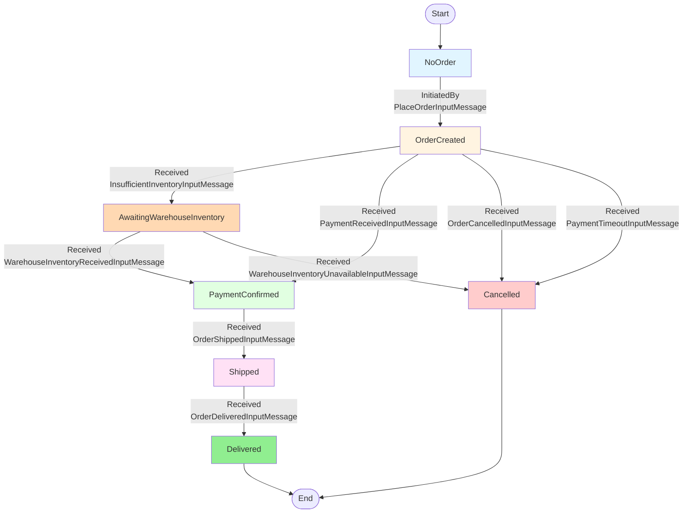

# OrderProcessingAsyncWorkflow - State Transitions (InternalEvolve)

This diagram shows the state transitions based on the `InternalEvolve` method of the asynchronous OrderProcessingWorkflow with inventory checking.

## State Descriptions

- **NoOrder**: Initial state, no order exists yet
- **OrderCreated**: Order has been placed, checking inventory
- **AwaitingWarehouseInventory**: Waiting for warehouse to confirm inventory availability
- **PaymentConfirmed**: Payment received successfully, ready to ship
- **Shipped**: Order has been shipped with tracking number
- **Delivered**: Order successfully delivered (terminal state)
- **Cancelled**: Order cancelled (timeout, customer request, or inventory unavailable) (terminal state)
