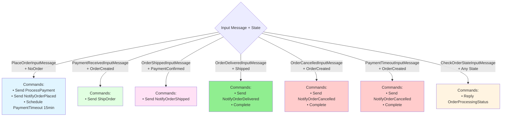

# OrderProcessingWorkflow - Decision Tree (Decide Method)

This diagram shows what commands are generated by the `Decide` method for each (Input, State) combination.

## Command Types

- **Send**: Dispatch a command to another service/handler
- **Schedule**: Defer a command for future execution
- **Complete**: Mark the workflow as finished
- **Reply**: Respond to a query (async workflow-to-workflow communication)
