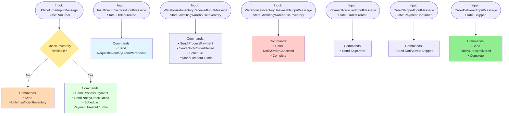

# OrderProcessingAsyncWorkflow - Decision Logic with Branching (DecideAsync Method)

This diagram shows the conditional logic and command generation in the async workflow's `DecideAsync` method.

## Key Decision Points

- **Inventory Check**: The workflow queries an external service to check inventory availability
- **Branching Logic**: Different commands are generated based on the inventory availability
- **Warehouse Fallback**: If local inventory is insufficient, request from warehouse
