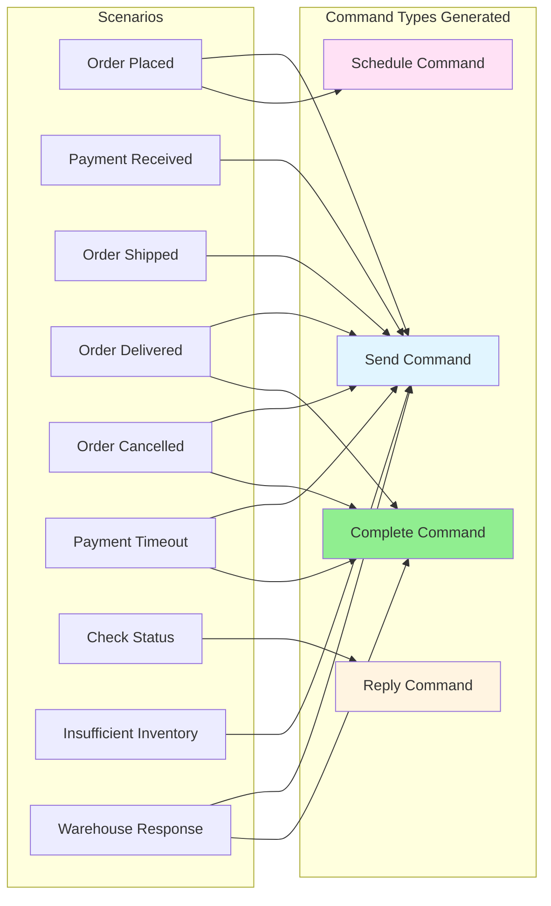

# Order Processing - Command Type Matrix

This diagram shows which command types are used in different workflow scenarios.

## Command Type Descriptions

- **Send**: Dispatch a command to another service/handler for processing
- **Schedule**: Defer a command for future execution (e.g., timeout handling)
- **Complete**: Mark the workflow instance as finished
- **Reply**: Respond to a query (for async workflow-to-workflow communication)

## Command Usage Patterns

- **Send** is used in almost all scenarios for dispatching work
- **Schedule** is used specifically for timeout handling
- **Complete** marks terminal states (Delivered, Cancelled)
- **Reply** is used for status queries
