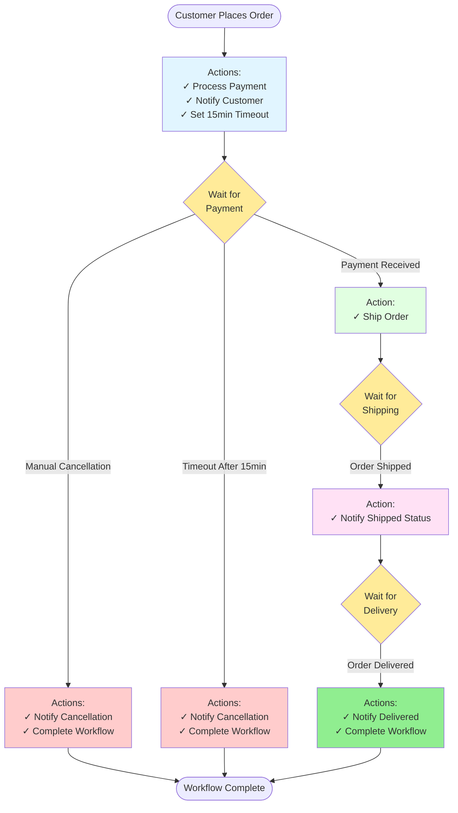

# Order Processing - Business Process Flow

This diagram shows the workflow from a business perspective with actions and decisions.

## Business Flow Description

1. **Order Placement**: Customer initiates order, system processes payment and sets timeout
2. **Payment Wait**: Three possible outcomes:
   - Payment received → proceed to shipping
   - Manual cancellation → cancel order
   - Timeout (15 minutes) → auto-cancel order
3. **Shipping Wait**: System waits for shipping confirmation
4. **Delivery Wait**: System waits for delivery confirmation
5. **Completion**: Workflow completes successfully or with cancellation

## Key Business Rules

- **15-minute payment timeout**: Orders not paid within 15 minutes are automatically cancelled
- **Customer notifications**: Customers are notified at each major step
- **Graceful cancellation**: Orders can be cancelled at the OrderCreated state
