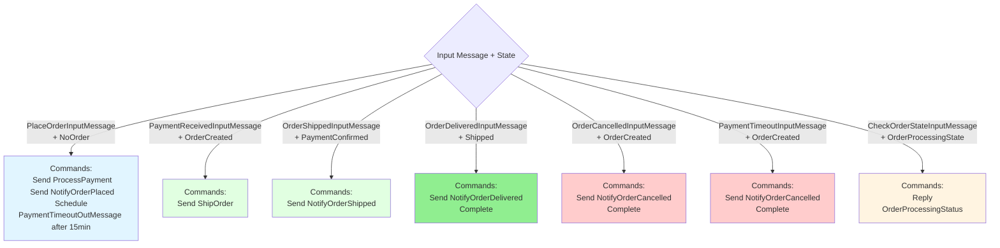

```mermaid
flowchart TD
    Start{Input Message + State}

    Start -->|PlaceOrderInputMessage<br/>+ NoOrder| D1[Commands:<br/> Send ProcessPayment<br/> Send NotifyOrderPlaced<br/> Schedule PaymentTimeoutOutMessage after 15min]
    Start -->|PaymentReceivedInputMessage<br/>+ OrderCreated| D2[Commands:<br/> Send ShipOrder]
    Start -->|OrderShippedInputMessage<br/>+ PaymentConfirmed| D3[Commands:<br/> Send NotifyOrderShipped]
    Start -->|OrderDeliveredInputMessage<br/>+ Shipped| D4[Commands:<br/> Send NotifyOrderDelivered<br/> Complete]
    Start -->|OrderCancelledInputMessage<br/>+ OrderCreated| D5[Commands:<br/> Send NotifyOrderCancelled<br/> Complete]
    Start -->|PaymentTimeoutInputMessage<br/>+ OrderCreated| D6[Commands:<br/> Send NotifyOrderCancelled<br/> Complete]
    Start -->|CheckOrderStateInputMessage<br/>+ OrderProcessingState| D7[Commands:<br/> Reply OrderProcessingStatus]

    style D1 fill:#e1f5ff
    style D2 fill:#e1ffe1
    style D3 fill:#e1ffe1
    style D4 fill:#90EE90
    style D5 fill:#ffcccc
    style D6 fill:#ffcccc
    style D7 fill:#fff4e1
```
